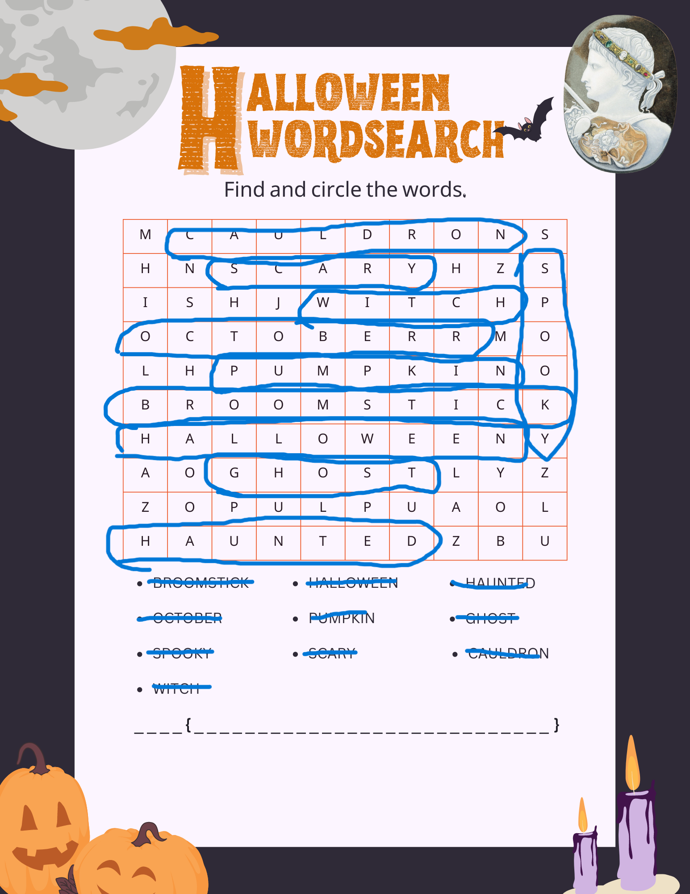

# Letter Soup

### Text: We believe we have ran into one of the newest members of DEADFACE while they were waiting for the train. The member seemed to have gotten spooked and stood up suddenly to jump on the train right before the doors shut. They seemed to have gotten away, but dropped this innocent looking word search. I believe this member might be actually a courier for DEADFACE. Let’s solve the word search to decode the mystery message. We believe the message might tell us their next move.

Submit the flag as flag{TARGETNAME} (e.g., flag{THISISTHEANSWER})

### Score: 10

Included Files: [Deadface_Word_Search.png](Deadface_Word_Search.png)

## Writeup
In this challenge you are given an encoded message that is believed to contain the flag for this challenge. All that is needed to be done is to decode the message by totating all of the characters by 8. The message contains the next target. I started by completing the wordsearch.

Completed word search- (Note I accidentally circled two Rs for October)


One thing to notice is that the length of the flag is given to you at the bottom. It is a total of 32 characters long. Since there are exectly 32 characters not used in the word search I wrote all of them down.

```
mshnhzishjrmlhaolyzzopulpuaolzbu
```

Again the flag can be found from this using a caesar cipher with 19 rotations

```
flagasblackfeathersshineinthesun
```

## Flag: flag{blackfeathersshineinthesun}