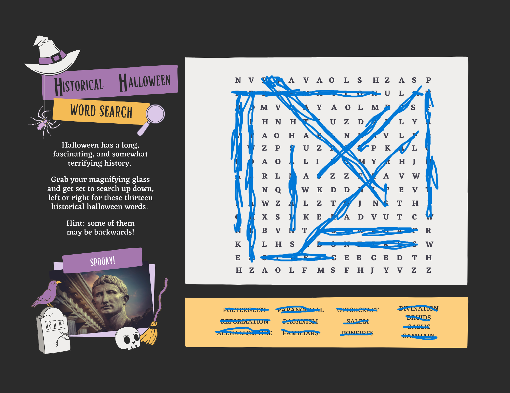

# Refill on Soup

### Text: How could we have missed this?? There were TWO word searches stuck together that the DEADFACE courier dropped. We’ve already solved the first one, but maybe solving this second word search will help us uncover the secret message they’re trying to covertly relay to the other members of DEADFACE. Hopefully, THIS will tell us how they plan to execute their next move.

Submit the flag as flag{TARGETNAME} (e.g., flag{THISISTHEANSWER})

### Score: 75

Included Files: [Word Search](Deadface_Word_Search_Part_2.png)

## Writeup
We are given another word search puzzle in this challenge. I started by competing this word search like the first challenge.



Like the previous challenge I then noted all of the characters that were not used.

```
nbavaolshzaspulmvyaolmshnhuzdlyaohanvlzpuzpklaoliyhjrlazzavwnqwkddevwzlztjnthxskeadvutcbvtrklhsweaebgbdthhzaolfmsfhjyvzz
```

If this message is useful then it requires some decryption. I was able to decode the message using the Vigenere Cipher. Here is a good website for automatically decrypting messages with the vigenere cipher - https://www.dcode.fr/vigenere-cipher.

```
gotothelastlinefortheflaganswerthatgoesinsidethebracketsstopgjpdwwxopsesmcgmaqldxtwonmvuomkdealpxtxuzuwmaastheyflyacross

goto the last line for the flag answer that goes inside the brackets stopgjpdwwxopsesmcgmaqldxtwonmvuomkdealpxtxuzuwmaastheyflyacross
```

As the final line is useful to us I decided to apply another caesar cipher to this line. After 19 rotations we are left with the message.

```
astheyflyacross
```

## Flag: flag{astheyflyacross}