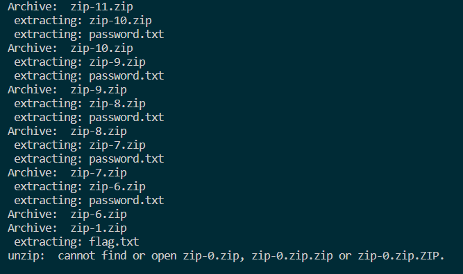

# zipzipzipzip

### Text: unzip me pls

&nbsp;

Score: 100

Included Files: [dist.zip](dist.zip) [password.txt](password.txt)

---
## Writeup
In this challenge you are given a zip file and a text file containing a password. When you try to unzip  *zip-25000.zip* and input the password given you are given a new *password.txt* file as well as a new zip files called... *zip-24999.zip*... oh no... Since no sensible person can do this by hand an option is to create a script to automatically unzip the files given. Here is my solution to unzipping all the files.

Bash script to unzip all files

```bash
#/bin/bash

echo "starting"

num=25000
prefix="zip-"
end=".zip"

file=$prefix$num$end

while [ $num -ge 0 ]
do

file=$prefix$num$end

password=`cat password.txt`

unzip -o -P $password $file

rm -f $file

num=$(( $num - 1 ))

done
```

Here is the output of the end of the program



At the end you can see that after extracting zip-1.zip you are left with a file flag.txt which contains the flag.


```
## Flag: TCP1P{1_TH1NK_U_G00D_4T_SCR1PT1N9_botanbell_1s_h3r3^_^}
